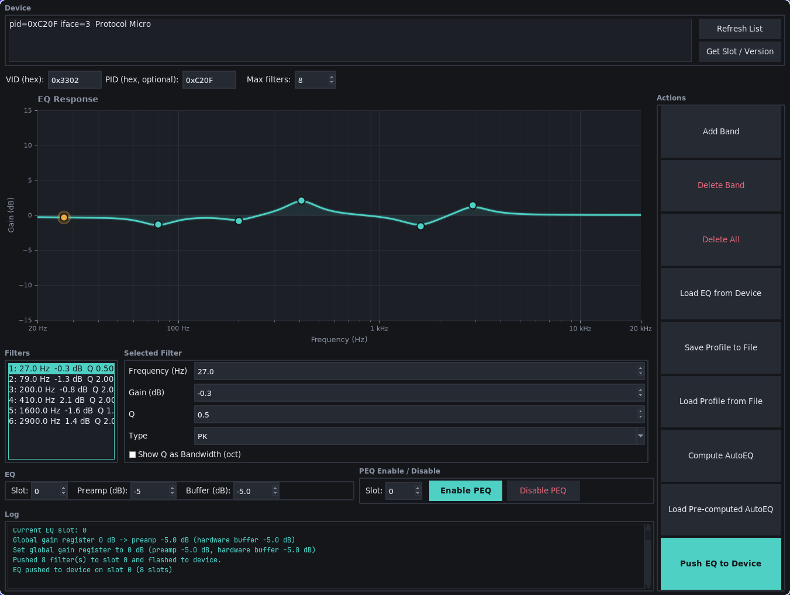
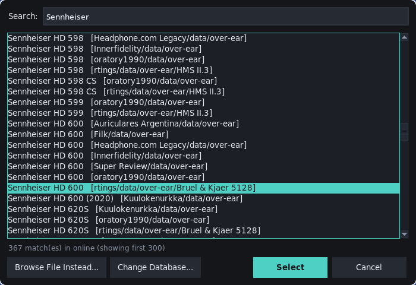

# walkplay-eqloader

A desktop tool for editing parametric EQ and pushing it to Walkplay-based USB DAC dongles (e.g. the Crinear Protocol Micro) without the vendor's app. It also generates EQ from headphone measurements with AutoEQ.



## Features

- **Visual EQ editor**: click the graph to add a band, drag a handle to move it, right-click to delete it. Values can also be typed in, and several selected bands can be edited at once.
- **Filter types**: Peaking (PK), Low Shelf (LSQ), High Shelf (HSQ), Low Pass (LP), High Pass (HP). Q can be shown as bandwidth in octaves.
- **Device**: push the EQ to any PEQ slot, load the current EQ back from the device, and enable/disable PEQ per slot.
- **Profiles**: save and load the `.txt` format used by EqualizerAPO and eq.hangout.audio.
- **AutoEQ**: pick a headphone/IEM model from the [AutoEq](https://github.com/jaakkopasanen/AutoEq) database and generate EQ bands plus a clip-safe preamp, or load the profile the AutoEq project already computed for it.
- **Undo/redo** for all editor changes.
- **CLI** for pushing and pulling profiles from scripts.

## Requirements

```
pip install hidapi matplotlib numpy
```

Python 3 with `tkinter`. On Linux, raw HID access needs a udev rule for the device, or running as root (`sudo python3 eqloader.py`). The AutoEQ database is fetched from GitHub, so AutoEQ needs an internet connection; everything else works offline.

## Usage

```
python3 eqloader.py [--force-graph | --no-graph]
```

Plug in the dongle and click **Refresh List** (F5); it appears in the Device list. Select it to use it for all device actions. With several Walkplay devices, pick the right one or enter its PID.

The graph hides automatically when the window gets too short to use it. `--force-graph` keeps it visible, `--no-graph` always hides it.

### Building an EQ

1. Click the graph to place a band, then drag it, or type exact values in the **Selected Filter** panel. Changes apply immediately.
2. Pick the filter type in **Type**.
3. To edit several bands at once, Ctrl-/Shift-click them in the **Filters** list; a changed field applies to all selected bands.
4. Set **Slot**, **Preamp** and **Buffer** in the **EQ** row and click **Push EQ to Device**.

### Preamp and buffer

The Protocol Micro always attenuates its output by a fixed 5 dB, set as **Buffer** (default `-5`). The device only stores the preamp beyond that, in whole dB: a preamp of −4.4 dB needs no extra attenuation, −9.6 dB is stored as 5 dB extra. **Load EQ from Device** reports the resulting preamp (stored value + buffer), so an exact preamp only survives through a saved profile file. If your device has no such buffer, set **Buffer** to `0`.

### Max filters

**Max filters** (default `8`) is the number of PEQ bands the device stores. Pushes are padded with inert 0 dB bands, because otherwise the device fills unused slots with copies of the last band. If the EQ has more bands than this, you're warned first: the device would silently drop the extras.

### AutoEQ



1. Click **Compute AutoEQ** (Ctrl+Shift+A).
2. The first time, choose **Download Online Database** (the AutoEq measurements on GitHub) or **Choose Local Folder...** with measurement `.txt`/`.csv` files. The choice is remembered.
3. Search for your model and select it. The same model often has measurements from several sources, shown in brackets. Downloads are cached. **Browse File Instead...** uses a single local file, **Change Database...** switches the source.
4. Pick a target: flat, a target from AutoEq's library (Harman, diffuse field, ...), or your own target file.
5. The generated bands and preamp replace the current EQ. Review them, then push.

> **Note:** Computing AutoEQ yourself is an experimental feature. It works, but results can differ from what autoeq.app or hangout.audio produce for the same measurement. For a well-tested result, use **Load Pre-computed AutoEQ** instead.

**Load Pre-computed AutoEQ** (Ctrl+Shift+L) skips the optimizer: pick a model from the online database the same way, and it loads the `ParametricEQ.txt` the AutoEq project computed for that measurement. If there are several (one per target), you pick one. This only works for models from the online database.

### Profiles and backups

- **Load Profile from File** loads a `.txt` profile. OFF bands, zero-gain bands and duplicate bands are dropped.
- **Save Profile to File** saves the current EQ and preamp.
- To back up the device, use **Load EQ from Device**, then **Save Profile to File**.

### Enabling / disabling the EQ

The **PEQ Enable / Disable** row switches the device EQ on or off for a slot without changing what's stored, e.g. for A/B comparisons. Not all devices support this.

### Keyboard shortcuts

Shortcuts are also shown when hovering over a button.

| Shortcut | Action |
|---|---|
| Ctrl+Z | Undo |
| Ctrl+Y / Ctrl+Shift+Z | Redo |
| Ctrl+B | Add Band |
| Ctrl+D | Delete Band |
| Ctrl+Shift+D | Delete All |
| Ctrl+E | Load EQ from Device |
| Ctrl+S | Save Profile to File |
| Ctrl+O | Load Profile from File |
| Ctrl+Shift+A | Compute AutoEQ |
| Ctrl+Shift+L | Load Pre-computed AutoEQ |
| Ctrl+P | Push EQ to Device |
| F5 | Refresh List |
| Ctrl+G | Get Slot / Version |
| Ctrl+Shift+E | Enable PEQ |
| Ctrl+Shift+X | Disable PEQ |

## CLI

The CLI covers pushing, pulling and listing devices, e.g. for scripts or desktop shortcuts. Editing and AutoEQ are GUI-only.

### Push a profile

```
python3 eqloader.py push <file> [options]
```

| Option | Default | Description |
|---|---|---|
| `--slot N` | `0` | PEQ slot to write to |
| `--buffer DB` | `-5` | Hardware gain buffer in dB (see [Preamp and buffer](#preamp-and-buffer)) |
| `--max-filters N` | `8` | Device filter slots; unused ones are padded with inert bands |
| `--no-gain` | | Don't write the preamp |
| `--no-enable` | | Don't enable PEQ after pushing |
| `--vid HEX` | `0x3302` | Vendor ID |
| `--pid HEX` | first device found | Product ID |

```
python3 eqloader.py push my_eq.txt --slot 1
```

### Pull the device EQ

```
python3 eqloader.py pull <file> [options]
```

Saves the device's current EQ and preamp as a `.txt` profile. Takes `--buffer`, `--max-filters`, `--vid` and `--pid` as above.

### List devices

```
python3 eqloader.py list
```

Prints the connected Walkplay HID devices with VID, PID, interface, product name and HID path.

## Profile format

The EqualizerAPO / eq.hangout.audio `.txt` format. Decimal commas and points both work.

```
Preamp: -6,0 dB
Filter 1: ON PK Fc 1000,0 Hz Gain 3,5 dB Q 1,000
Filter 2: ON LS Fc 80,0 Hz Gain -2,0 dB Q 0,707
Filter 3: OFF PK Fc 100,0 Hz Gain 0,0 dB Q 1,000
```

Filter types: `PK`, `LS`/`LSC`/`LSQ`, `HS`/`HSC`/`HSQ`, `LP`, `HP`. OFF bands and peaking/shelf bands with 0 dB gain are treated as disabled.

## Supported hardware

Walkplay-vendor HID devices (VID `0x3302`). Tested on the **Crinear Protocol Micro** (PID `0xC20F`). Other Walkplay dongles may work; please open an issue if yours behaves differently.
