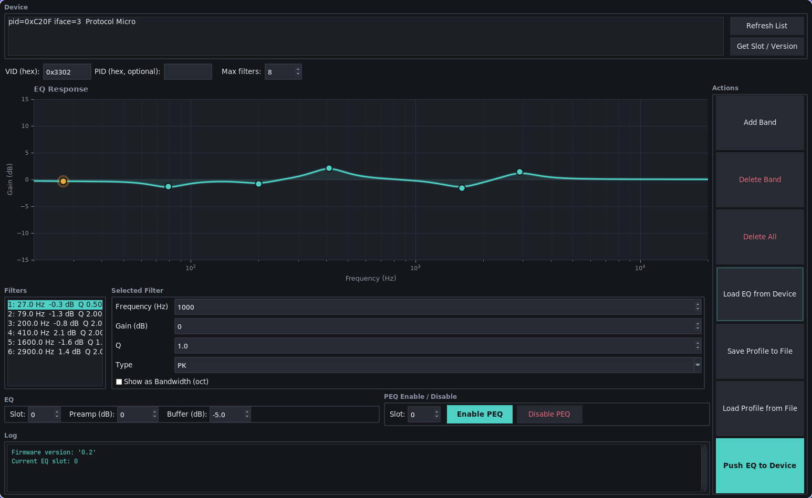

# walkplay-eqloader

A standalone desktop tool for pushing and editing parametric EQ profiles on Walkplay-based USB DAC dongles (e.g. Crinear Protocol Micro) — no internet connection or proprietary app required.



## Features

- **Visual EQ editor** — drag band handles directly on the frequency response graph to tune frequency and gain interactively. Click empty space to add a new band; right-click a handle to delete it.
- **5 filter types** — Peaking (PK), Low Shelf (LSQ), High Shelf (HSQ), Low Pass (LP), High Pass (HP).
- **Q / Bandwidth toggle** — switch the Q field to octave bandwidth and back without losing precision.
- **Push to device** — write the current EQ to any PEQ slot with a configurable preamp level and hardware gain buffer.
- **Load from device** — read the current EQ back from the dongle into the editor.
- **Save / load profiles** — read and write the standard `.txt` format used by eq.hangout.audio and EqualizerAPO, so existing community profiles work out of the box.
- **OFF-band handling** — `OFF` bands and peaking/shelf filters with zero gain are automatically skipped when loading, matching the device's own behaviour.
- **Enable / disable PEQ** — toggle the hardware EQ on or off per slot without touching the stored profile.
- **Undo / redo** — full history for all editor changes (Ctrl+Z / Ctrl+Y / Ctrl+Shift+Z).

## Requirements

```
pip install hidapi matplotlib numpy
```

Standard library modules (`tkinter`, `math`, `threading`, etc.) are included with Python 3.

On Linux you may need udev rules or to run as root for raw HID access:

```
sudo python3 eqloader.py
```

## Usage

### Starting up

```
python3 eqloader.py [--graph-no-hide | --no-graph]
```

Plug in your dongle, then click **Refresh List** — it will appear in the Device list at the top. Select it to target it for all push/pull operations. If you have multiple Walkplay devices, pick the right one or set the PID field manually.

The frequency-response graph is shown by default and hides automatically when the window is too short to use it precisely. Pass `--graph-no-hide` to keep it visible at all times, or `--no-graph` to always hide it (useful in small or tiling windows).

### Building an EQ from scratch

1. Click anywhere on the graph to place a new band at that frequency and gain.
2. Drag the band handle to adjust it, or type exact values in the **Selected Filter** panel on the left.
3. Choose a filter type from the **Type** dropdown (PK, LSQ, HSQ, LP, HP). Q becomes less relevant for shelves and is hidden from the graph but still editable.
4. Add as many bands as the device supports (default: 8). Use **Delete Band** or right-click a handle on the graph to remove one.
5. Set **Slot**, **Preamp**, and **Buffer** in the Created EQ row, then click **Push Created EQ** in the Actions panel.

### Loading an existing profile

1. Click **Load Profile** in the Actions panel and select a `.txt` file.
2. The bands load into the editor — disabled (`OFF`) and inert bands are filtered out automatically.
3. Review the curve on the graph, tweak if needed, then push.

### Backing up what's on the device

1. Click **Load from Device** — the current EQ is pulled and shown in the editor.
2. Click **Save Profile** to write it to a `.txt` file you can keep or share.

### Max filters

The **Max filters** field in the Device row (default `8`) is the number of PEQ slots your device stores.

- **On push:** if your EQ has fewer bands than this, the remaining slots are padded with inert (0 dB) dummy bands so the device doesn't backfill them with copies of your last band.
- **On load:** exact-duplicate bands (which the device creates when padding its unused slots) are collapsed to a single band.

Set this to match your device's actual slot count if it isn't 8.

### Enabling / disabling the EQ

**Note:** this is note suported on evey device

Use the **PEQ Enable / Disable** row to turn the hardware EQ on or off for a given slot without overwriting the stored profile. Useful for quick A/B comparisons.

### Keyboard shortcuts

Every action has a keyboard shortcut (also shown on the buttons themselves):

| Shortcut | Action |
|---|---|
| Ctrl+Z | Undo |
| Ctrl+Y / Ctrl+Shift+Z | Redo |
| Ctrl+R | Reload Graph |
| Ctrl+B | Add Band |
| Ctrl+D | Delete Band |
| Ctrl+Shift+D | Delete All Bands |
| Ctrl+E | Load EQ from Device |
| Ctrl+S | Save Profile to File |
| Ctrl+O | Load Profile from File |
| Ctrl+P | Push EQ to Device |
| F5 | Refresh Device List |
| Ctrl+G | Get Slot / Version |
| Ctrl+Shift+E | Enable PEQ |
| Ctrl+Shift+X | Disable PEQ |

## CLI & flags

All GUI features are also available headlessly, useful for scripting or automation, or embedding EQ Profiles into your Desktop Environment.

### GUI flags

| Flag | Description |
|---|---|
| `--graph-no-hide` | Always show the frequency-response graph |
| `--no-graph` | Always hide the frequency-response graph |

Without either flag the graph is shown normally and hides automatically when the window becomes too small to interact with.

### Push a profile to the device

```
python3 eqloader.py push <file> [options]
```

Loads a `.txt` profile and writes it to the device.

| Option | Default | Description |
|---|---|---|
| `--slot N` | `0` | PEQ slot to write to |
| `--buffer DB` | `0.0` | Hardware gain buffer in dB |
| `--no-gain` | — | Skip writing the preamp gain |
| `--no-enable` | — | Don't enable PEQ after pushing |
| `--vid HEX` | `0x3302` | Override vendor ID |
| `--pid HEX` | auto | Target a specific product ID |

Example:

```
python3 eqloader.py push my_eq.txt --slot 1 --buffer 3.5
```

### Pull the current EQ from the device

```
python3 eqloader.py pull <file> [options]
```

Reads the active EQ from the dongle and saves it as a `.txt` profile.

| Option | Default | Description |
|---|---|---|
| `--max-filters N` | `8` | Maximum number of bands to read |
| `--vid HEX` | `0x3302` | Override vendor ID |
| `--pid HEX` | auto | Target a specific product ID |

Example:

```
python3 eqloader.py pull backup.txt
```

### List connected devices

```
python3 eqloader.py list
```

Prints all connected Walkplay HID devices with their VID, PID, and serial number.

## Profile format

Profiles follow the EqualizerAPO / eq.hangout.audio `.txt` convention:

```
Preamp: -6,0 dB
Filter 1: ON PK Fc 1000,0 Hz Gain 3,5 dB Q 1,000
Filter 2: ON LSQ Fc 80,0 Hz Gain -2,0 dB Q 0,707
Filter 3: OFF PK Fc 100,0 Hz Gain 0,0 dB Q 1,000
```

`OFF` bands and peaking/shelf filters with zero gain are treated as disabled and are not pushed to the device.

## Supported hardware

Any Walkplay-vendor HID device (VID `0x3302`). Tested on the **Crinear Protocol Micro** (PID `0xC20F`). May work on other Walkplay dongles — open an issue if yours behaves differently.
